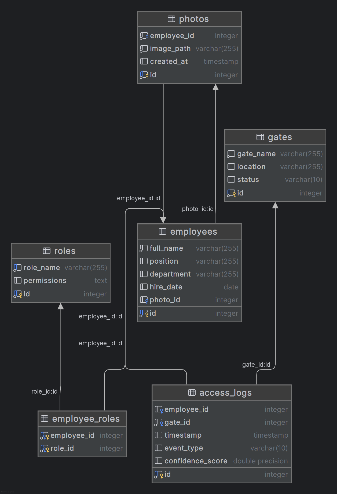

# Кейс 2: Система идентификации личности по фотографии
*Описание*: Сейчас процесс проверки личности на проходной полностью ручной - на КПП дежурный сканирует пластиковый пропуск и "на глаз" проверяет сходство человека с фотографией в его профиле. Руководство предприятия хочет автоматизировать этот процесс, создав систему автоматического распознавания фото человека на проходной по базе сотрудников.

Количество сотрудников на предприятии ~5000. Количество проходных - 10.
## Состав команды
 - Зеленин Денис (data scientist)
 - Прокопец Семен (product owner)
 - Николай Игнатенков (Bombordiro crocolido)

## Бизнесс процесс до и после внедрения
### До 

### После

## Диаграммы структуры данных информационной системы
Краткое описание 

- employees  
    Содержит данные о сотрудниках: имя, должность, отдел, дата приема на работу и ссылка на основное фото.

- photos  
    Хранит фотографии сотрудников. Каждая фотография связана с сотрудником через employee_id.

- gates  
    Информация о проходных (КПП): название, расположение и статус (активна/неактивна).

- roles  
    Определяет роли доступа (например, "администратор", "инженер"). Содержит разрешения в виде текста или JSON.

- employee_roles  
    Связывает сотрудников с их ролями (многие-ко-многим). Позволяет одному сотруднику иметь несколько ролей и одной роли быть назначенной нескольким сотрудникам.

- access_logs  
    Журнал событий прохода через КПП. Фиксирует время, тип события (вход/выход), уверенность системы в распознавании и информацию о сотруднике и проходной.

## 1 Цели и предпосылки
Цель разработки — автоматизировать процесс идентификации личности на проходных предприятия, чтобы заменить ручную проверку (сравнение фотографии на пропуске с лицом сотрудника) на более точное и быстрое решение.  
### Улучшения, которые придут с ML
 - Скорость: Автоматическая проверка займет секунды вместо ручного сравнения.

 - Точность: Исключается человеческий фактор (усталость, невнимательность).

 - Безопасность: Снижается риск проникновения посторонних (поддельные пропуска, передача карт доступа).

 - Масштабируемость: Система легко адаптируется под рост числа сотрудников (сейчас ~5000).

### Бизнес-требования и ограничения: 
#### Требования:

- Обрабатывать ~5000 сотрудников и 10 проходных.

- Интеграция с текущей системой учета пропусков.

- Минимальные задержки при проходе (чтобы не создавать очереди).

#### Ограничения:

- Разнообразие условий съемки (освещение, ракурс, наличие масок/очков).

- Необходимость высокой точности (ложные отказы могут блокировать легитимных сотрудников).

-  Защита персональных данных (фотографии сотрудников).

### Функциональные и нефункциональные требования

#### Функциональные:

- Распознавание лица по фото из базы.

- Сравнение в реальном времени с эталоном.

- Интеграция с турникетами/шлагбаумами.

- Логирование попыток входа.

#### Нефункциональные:

- Время обработки <1 секунды.

- Точность (по метрике).

- Работа при разном освещении/ракурсах.

- Отказоустойчивость (если система упала — переход на ручную проверку)

### Пилот и критерии успеха 

#### Пилот:

- Развернуть систему на 1-2 проходных.

- Тестировать на группе сотрудников (100-200 человек).

- Сравнивать скорость и точность с ручной проверкой.

#### Критерии успеха:

- Скорость идентификации ≤3 сек.

- Точность (ложные отказы <2%, ложные допуски <0.5%).

- Удовлетворенность сотрудников (опрос).

- Отсутствие сбоев в работе.

### MVP и технический долг

MVP:

- Работа с камеры (стандартные ракурсы).

- Интеграция с 1-2 проходными.

- Базовая система логирования.

- Простой интерфейс для администратора.

Технический долг:

- Поддержка масок/очков.

- Расширенная аналитика (подозрительные попытки доступа).

- Мультифакторная аутентификация
